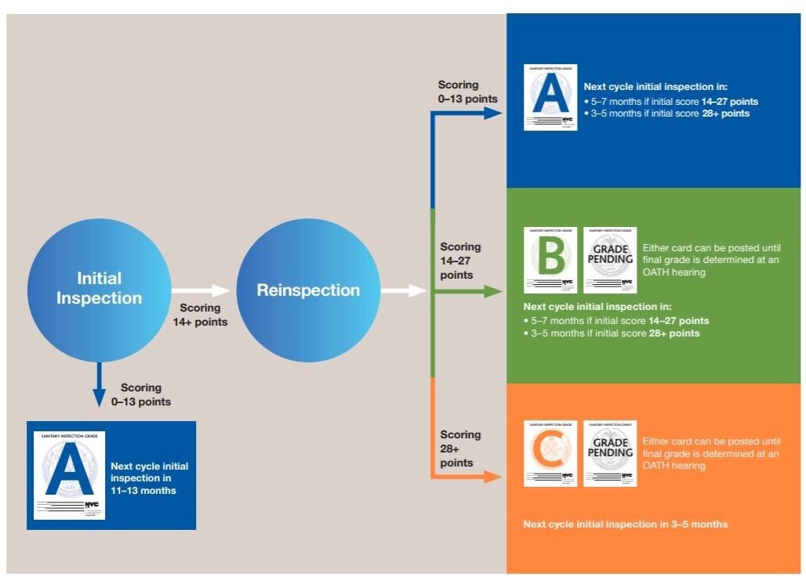

# Analysis of DOHMH New York City Restaurant Inspection Results

This project was done by me as part of the course **_'CS544 Foundations of Analytics with R'_**

The goal of this project is to analyze and interpret the results across multiple variables and find interesting observations, co-relations or patterns

## About the dataset

The dataset contains every sustained or not yet adjudicated violation citation from every full or special program inspection conducted up to three years prior to the most recent inspection for restaurants and college cafeterias in an active status on the RECORD DATE (date of the data pull). When an inspection results in more than one violation, values for associated fields are repeated for each additional violation record. Establishments are uniquely identified by their CAMIS (record ID) number. Only restaurants in an active status are included in the dataset.

Records are also included for each restaurant that has applied for a permit but has not yet been inspected and for inspections resulting in no violations. Establishments with inspection date of 1/1/1900 are new establishments that have not yet received an inspection. Restaurants that received no violations are represented by a single row and coded as having no violations using the ACTION field.

So how are these grades actually determined? Per DOHMH, restaurants receive an initial inspection during which they are assigned points for any violations found. If those points add up to less than 14, the restaurant receives an A and will be reinspected in 12 months. If the restaurant receives 14 or more points, the restaurant will be reinspected 7 or more days later. The score from the re-inspection determines the grade to be posted. If the restaurant scores more than 14 points again, they have the option of posting their B or C grade card or a “GRADE PENDING” card, until their violations are adjudicated through an Office of Administrative Trials and Hearings (OATH) hearing. This process is summarized in the graphic below.

In other words, each restaurant has three chances per cycle to receive an A (Initial inspection, re-inspection, final adjudication). Note that the initial score also determines how quickly the inspection cycle begins again for each restaurant; restaurants with a higher number of violations are reinspected sooner than those with fewer violations. This graphic also does not describe conditions under which restaurants face closure by the DOHMH.

This dataset and the information on the Health Department’s Restaurant Grading website come from the same data source.

The data about inspection result can be found at https://data.cityofnewyork.us/Health/DOHMH-New-York-City-Restaurant-Inspection-Results/43nn-pn8j

The Health Department’s Restaurant Grading website is here: http://www1.nyc.gov/site/doh/services/restaurant-grades.page

## Note

- I have not included the csv data file due to its size, please download the csv from [here](https://data.cityofnewyork.us/Health/DOHMH-New-York-City-Restaurant-Inspection-Results/43nn-pn8j) and put the csv file in [data](data) folder
- Run the [rmd file](src/FinalProject_NYRestaurantInspection.rmd) in R Studio and _knit to HTML_
- My analysis report can be found [here](report). Download the HTML file and open in browser.
